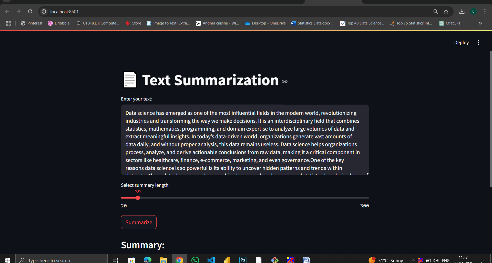
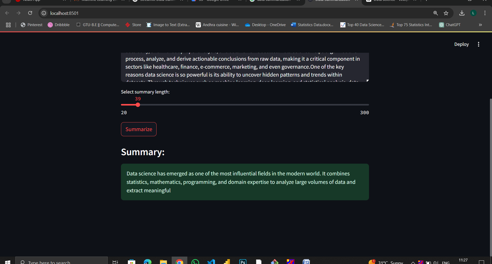

# 📝 AI-Powered Text Summarization App
### NLP-Based Abstractive Text Summarization using Transformers & Streamlit

---

## 📌 Problem Statement

In today’s data-driven world, large volumes of textual information are generated daily from articles, reports, blogs, and research papers. Reading and understanding long documents is time-consuming and inefficient.

There is a need for an intelligent system that can:
- Automatically summarize long text
- Preserve key information
- Reduce reading time
- Provide customizable summary length

---

## 🎯 Project Objective

To build an AI-powered web application that:

- Accepts long-form text input
- Generates an accurate abstractive summary
- Allows dynamic summary length control
- Provides real-time summarization using NLP models

---

## 🛠️ Tech Stack

| Technology | Purpose |
|------------|----------|
| Python | Core Programming |
| Transformers (Hugging Face) | NLP Model |
| BART / T5 Model | Text Summarization |
| Streamlit | Web Application UI |
| PyTorch | Deep Learning Backend |

---
## 📈 Skills Demonstrated

- Natural Language Processing (NLP)  
- Transformer-based Models (BART / T5)  
- Abstractive Text Summarization  
- Deep Learning Model Inference (PyTorch)  
- Hugging Face Transformers Integration  
- Streamlit Web App Development  
- End-to-End ML Application Deployment  
- UI/UX Design for Machine Learning Applications  
- Dynamic Parameter Control (Summary Length Tuning)

## 📸 Application Screenshots

### 🔹 1️⃣ Text Input Interface

---

### 🔹 2️⃣ Generated Summary Output

